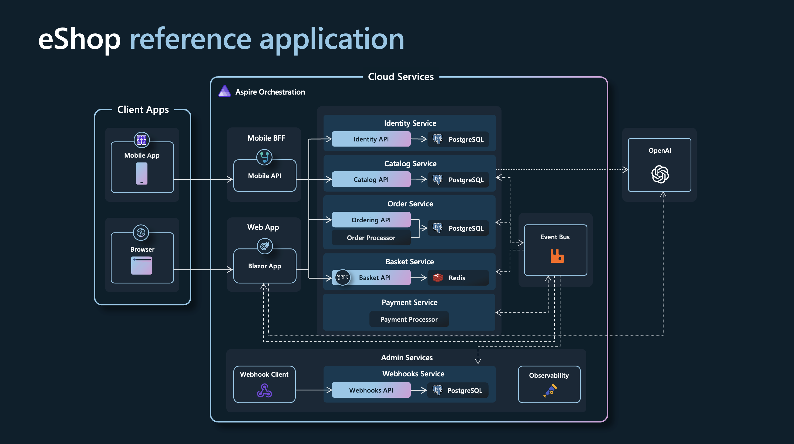

# Fullstack Java Opdracht

## Opdracht

### Omschrijving
* Beheren en publiceren van interne nieuwsartikelen binnen organisatie
* Stelt redacteuren in staat om nieuwsartikelen te schrijven, goed te keuren en te publiceren

### 3 microservices
* **PostService**
     * Laat redacteurs toe om ``posts`` te maken en aan te passen
* **ReviewService**
     * Laat redacteurs toe om ``posts`` goed te keuren of af te wijzen
* **CommentService**
     * Laat gebruikers toe om ``comments`` te plaatsen op ``posts``

## User Stories

### PostService

* **US1:** Als ``redacteur`` wil ik nieuwe ``posts`` kunnen aanmaken, zodat ik nieuws en updates kan delen met de organisatie.
  * Een redacteur moet in staat zijn om een nieuw artikel te schrijven en op te slaan in het systeem.
  * **Completed**
* **US2:** Als ``redacteur`` wil ik ``posts`` kunnen opslaan als concept, zodat ik er later aan kan verderwerken of kan wachten op goedkeuring.
  * Een redacteur moet een artikel kunnen opslaan als concept, zodat het later kan worden bewerkt of beoordeeld.
  * **Completed**
* **US3:** Als ``redacteur`` wil ik de inhoud van een ``post`` kunnen bewerken, zodat ik fouten kan corrigeren en inhoud kan bijwerken.
  * Een redacteur moet bestaande artikelen kunnen aanpassen om fouten te corrigeren of nieuwe informatie toe te voegen.
  * **Completed**
* **US4:** Als ``gebruiker`` wil ik een overzicht van gepubliceerde ``posts`` kunnen zien, zodat ik op de hoogte blijf van het laatste nieuws.
  * Gebruikers moeten een lijst kunnen zien van alle gepubliceerde artikelen.
  * **Completed**
* **US5:** Als ``gebruiker`` wil ik ``posts`` kunnen filteren op basis van inhoud, auteur & categorie.
  * Gebruikers moeten artikelen kunnen filteren op specifieke criteria zoals inhoud, auteur en categorie.

### ReviewService

* **US6:** Als ``hoofdredacteur`` wil ik ``ingediende posts`` kunnen bekijken en goedkeuren of afwijzen, zodat alleen goedgekeurde content wordt gepubliceerd.
  * Hoofdredacteuren moeten ingediende artikelen kunnen beoordelen en beslissen of ze worden gepubliceerd of afgewezen.
* **US7:** Als ``redacteur`` wil ik een ``melding`` ontvangen wanneer een ``post`` goedgekeurd of afgewezen is, zodat ik weet of het gepubliceerd kan worden of moet worden herzien.
  * Redacteuren moeten notificaties ontvangen over de status van hun ingediende artikelen.
* **US8:** Als ``redacteur`` wil ik opmerkingen kunnen toevoegen bij afwijzing van een ``post``, zodat de ``redacteur`` weet welke wijzigingen er nodig zijn.
  * Redacteuren moeten feedback kunnen geven bij het afwijzen van een artikel, zodat de auteur weet wat er moet worden aangepast.

### CommentService

* **US9:** Als ``gebruiker`` wil ik een ``reactie`` kunnen plaatsen op een ``post``, zodat ik mijn mening kan delen of vragen kan stellen.
  * Gebruikers moeten reacties kunnen plaatsen onder artikelen.
* **US10:** Als ``gebruiker`` wil ik ``reacties`` van andere collega’s kunnen lezen, zodat ik een indruk krijg van hun mening of vragen over het artikel.
  * Gebruikers moeten de reacties van anderen kunnen lezen om inzicht te krijgen in hun meningen en vragen.
* **US11:** Als ``gebruiker`` wil ik mijn eigen ``reacties`` kunnen bewerken of verwijderen, zodat ik altijd mijn eigen bijdragen kan corrigeren of verwijderen.
  * Gebruikers moeten hun eigen reacties kunnen aanpassen of verwijderen.

## Authenticatie

* Uitwerken authenticatie is niet nodig
* Frontend
  * AuthService die een rol / user bijhoudt
  * Wijzigen rol / user via login scherm, geen communicatie met backend nodig 
* Backend
  * Leest rol / user uit de header en gebruikt in de logica

## Extra Informatie

* Er moet communicatie zijn tussen de 3 services
  1. Met ``OpenFeign``
  2. Via de ``message bus``
* Microservices moeten onafhankelijk van elkaar blijvan werken
* Test coverage moet ``70% Backend`` en ``50% Frontend`` zijn
* Pas ``LogBack`` toe in elke microservice, log zeker naar ``file``
* Kortom, alles in de labos, dient te worden toegepast

## Stappenplan

### Stap 1: Architectuur
* Oplevering: voor maandag 18/11 23:59 (git commit + push)
* Ook communicatie tussen micro-services documenteren
* Voorbeeld
  
* Geen code beginnen schrijven vooraleer dit is afgecheckt door alle lectoren
  * Backend: Tom Schuyten
  * Frontend: Dries Swinnen
  * Via privebericht op Teams

### Stap 2: Wekelijkse Sessies
* Werk actief tijdens de sessies aan de opdracht
* Werken via Github
* Eigen verantwoordelijkheid voor planning
* Controleer regelmatig of je alle vereisten hebt afgewerkt
* Bij online sessies
  * Start een meeting in team kanaal van jouw klas
  * Lectoren komen virtueel langs en registreren aanwezigheden

### Stap 3: Evaluatie Examen
* Als de minimale functionele vereisten onvoldoende zijn geïmplementeerd, kan je niet deelnemen aan het examen
* Tijdens examen
  * Individueel
  * Mondeling
  * Op je eigen toestel
* Je wordt geëvalueerd op je kennis en kunde
* Puntenverdeling
  * ``20%`` Implementatie minimale vereisten
  * ``80%`` Toelichten code en gebruikte concepten

## Examen (Inhoudelijk)

### Mondeling toelichten van code
* “Hoe heb je databinding toegepast?” 
* “Waar heb je DDD concepten gebruikt in je code?” 
* “Hoe heb je logging gebruikt?”
* Kan over elk onderdeel gaan

### Je moet ook concepten kunnen uitleggen en in verband brengen met je eigen code
* "Wat is een EventEmitter?"
* "Waar heb je dat gebruikt?"
* "Waarom?"
* "Dependency Injection?"
* "Wat, waarom en hoe?"

### Tweede zit
* Extra user stories worden toegevoegd